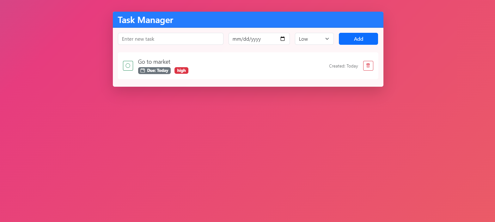

# Task Manager

A modern, responsive web application for managing daily tasks with priority levels and due dates.



## Features

- ✅ Create, read, update and delete tasks
- 📅 Set due dates for tasks
- 🎯 Assign priority levels
- ✨ Clean and responsive UI
- 🔄 Real-time updates
- 📱 Mobile-friendly design
## Technologies Used

- **Backend**
  - Node.js
  - Express.js (^4.18.0)
  - EJS (^3.1.9)
  - date-fns (^2.30.0)
  - dotenv (^16.3.1)
  - mongoose (^7.5.0)
  - express-validator (^7.0.0)

- **Frontend**
  - Bootstrap 5
  - Bootstrap Icons
  - Custom CSS with animations
  - Responsive design


## Installation

1. Clone the repository:

```bash
git clone <your-repo-url>
cd task-manager
```

2. Install dependencies:

```bash
npm install
```

3. Start the application:

```bash
npm start
```

The app will be available at `http://localhost:3000`

